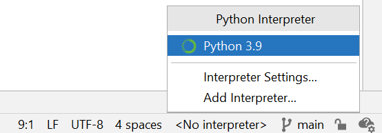
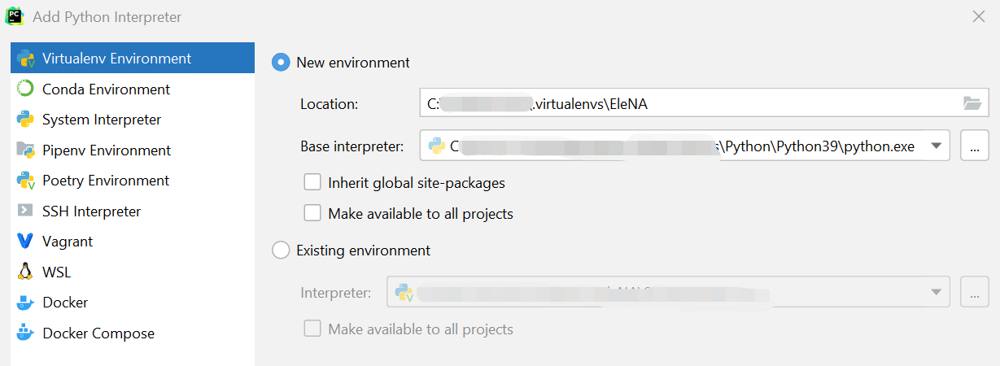
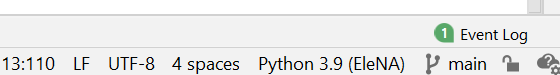
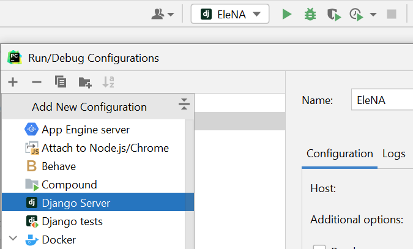

# EleNA

CS520 final project group: little_five

## How to run

Some steps are specific to PyCharm. If you are using other IDE, this instruction may not helping you finish set up.

### Environment set up

We recommend create a virtual environment for this project.

- In the lower right corner of PyCharm, choose `Add Interptreter`. Then choose `New environment`
  

      If you choose to use `pipenv` commend to create virtual environemnt, you can add it by choosing `Exist environment`.

  
  If you see the new environment name occur at the place `<No interpreter>`, the environment should be success.
  

      If you restart Pycharm, the new environment should activate automatically, or you can activate it using manually.

- Install all required package using `pip install -r requirements.txt`
- Next to running button in upper right corner, choose `edit configurations`
  

      Add Django Server. In the Environment section, choose the python interpreter you just create and set proper environment variables.

Now you should be able to run this project by clicking run button.

# Frontend

## How to start the frontend server

Please make sure you have installed "npm" package on your machine
Execute this line under the /frontend

```
npm start
```
